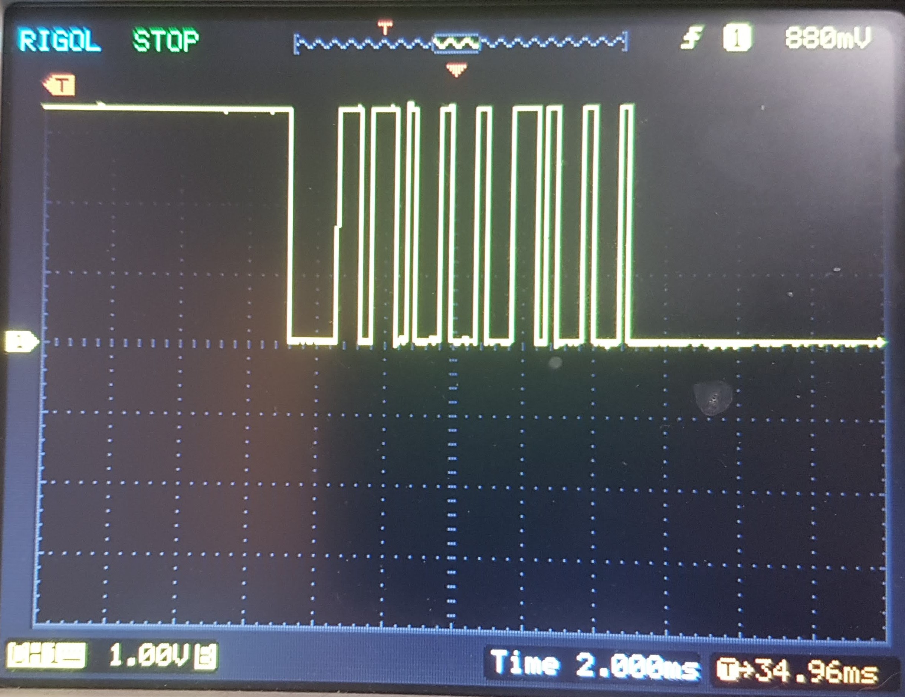
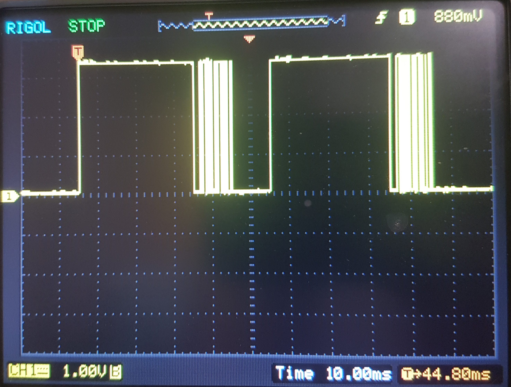

# Weiser Powerbolt 2 ESP32 Interface #

* Also sold as Kwikset 907 Powerbolt 2.0
* Should work on some other keypad-based deadbolts (there are additional features)

## Introduction ##

This is an example firmware that demonstrates an ability to interact with the Powerbolt 2 deadlock.  The intention is to enable remote Wifi management and access through an ESP32.  While there appears to be two unsoldered button spots on the main PCB, they do nothing, so this DIY protocol hack is required.

## Hardware ##

* SONIX SN8P2613 on both keypad and main body (datasheets available)
* 4-pin connection between keypad and main body consists of 3.3v, in, out, gnd
* One-wire protocol on each *in* and *out* pins

### Protocol ###
* Each packet is 10 bits long
* Each packet is sent twice with a 10ms delay between them (built in to the stop bit)
* Start bit = 30ms high and around 1.4ms low
* 8 data bits
  * Low = 0.3ms high and 0.7ms low
  * High = 0.7ms high and 0.3ms low
* Stop bit = 0.3ms high and 10ms low

## Research ##

* It is possible to send a key that does not have a corresponding button on the actual keypad.  In theory, a code containing this key would not be possible to enter using the physical keypad.  Such a code could only ever be entered through the ESP32 interface, meaning that it would be a remote-only key.
    * If the master code contained an unpressable key, the lock would not be able to be programmed physically without a reset, and would become remote-programmable only.
    * This is represented in the firmware as the *Unknown* key
* The keypad tells the deadbolt when a timeout has occurred by sending a D4 (clear) command.  The deadbolt then sends a sequence of C3 (red flash 3 times) and beeps 3 times, then sends a C7.  Other models of keypad have a Clear button.
    * The keypad also decides when a timeout occurs in the master code menu by sending a D2 when it stops blinking the LED yellow.

## Sequences from deadbolt to LED keypad ##

* Door is locked: pressing any button and waiting for a timeout
    * C4 - green blip then stay on for 3s until timeout
    * C3 - 3 quick red flashes during beep beep beep
    * C7 - when the lights go off after beeping
* Door is locked: pressing sequence of buttons
    * C4 - each time a button is pressed, blip and stay green
* Door is unlocked: pressing lock button
    * C4 - blip and stay green while the lock is spinning for 3s
    * C1 - when lock is finished
    * C7 - when the lights go off
* Door is locked: entered master code
    * C3, C7 sequence (not allowed while door is locked)
* Door is unlocked: entered master code
     * C8 - long yellow, odd beep
     * C1 - green 
     * C7 - done
* Reset button pressed
    * CB - yellow blip
    * Reset button released
        * CC - nothing
        * C7 - done
* Reset button held
    * CB - yellow blip
    * CC - reset
    * CA - 3 yellow medium
    * C7 - when the lights go off

## Sequences from LED keypad to deadbolt ##

* Pressed 90 key
    * 05 - digit sent
    * D4 - after timeout, caused beeping
* Pressed lock key while locked
    * 0E - lock key
    * D4 - after timeout, caused beeping
